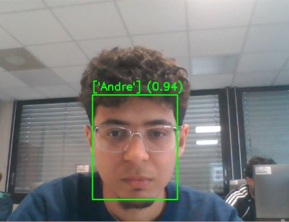
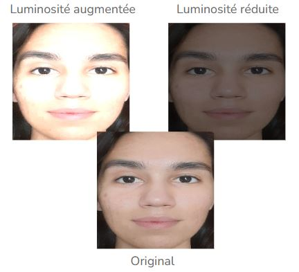
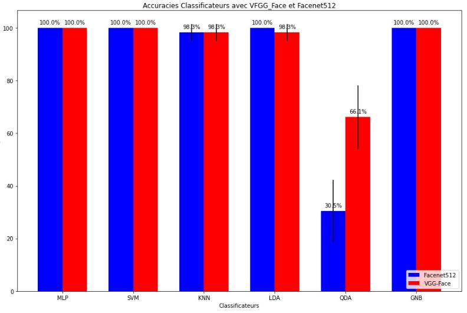

# Facial-Recognition
Polytech work in computer vision for facial recognition of all classmates 
of the course of computer vision. 

It was used the library DeepFace to extract the embeddings, and classifier models
to determine from which person belongs the photo.

## Dataset

It was used a dataset with 10 photos of each person in the class, that is composed
of 11 people, with the face well appeared in each of them.

## Implementation

For the implementation of the solution it was necessary a sequence of steps. 
At first, it was necessary to cut all the photos to only appear the face of each person.
As the dataset is the ground truth, it was made by hand, with each person cutting
your own photos, so it didn't turn a long work.

The sequence of steps of the implementation consisted in extracting the embeddings of the image,
and to train a classifier to determine who is the author of the photo.

### Embeddings Extraction

To extract the embeddings it was used the library DeepFace, that offers a framework
to facilitate the testing of differents models to do it. So, using that library
it was tested the "VGG-Face" and "Facenet512" models.

### Face Classification

For the classification part, it was tested many models to get the best, and 
compare the results:
MLPClassifier, KNN, SVMClassifier, LinearDiscriminantAnalysis, 
QuadraticDiscriminantAnalysis and GaussianNB.

The input of the model was the embeddings and the ground truth the name of the
person.

### Data Augmentation

To get good results it was necessary to do data augmentation techniques. The
reason is because the dataset is too short for each person, and it doesn't cover
many possible scenarios that happen in real time.

So, the techinique applied was the variation of luminosity of the photo, and it
improved the results considerably.

### Results

The results of each classifier, with VGG-Face and Facenet, are shown in the 
figure below. They were evaluated within the database that was splitted in 
train and test. 

### Real time

In real time, the results were a little worse, because it happens scenarios
not covered by the dataset, but still got good results.

To evaluate in real time it was necessary an algorithm for face detection, to get
the face cutted automatically for the embedding extraction and face classification.
To do it task, it was used tested the detecion models, that are aggregated in 
DeepFace, "MTCNN" and the deepface implementation using "OpenCV". 

The MTCNN got better results detecting faces, but it slowed down the execution
of the code. In contrast the solution with OpenCV was faster, but didn't performed
very well. So, it was prefered the solution with MTCNN.